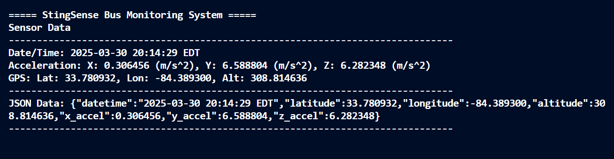

# 🐝 **StingSense: Buzzing into the Future of Bus Monitoring**

Welcome to the hive of innovation! At Georgia Tech, we're revolutionizing campus transportation with **StingSense**, an IoT-powered project that tracks and analyzes the behavior of Georgia Tech's Stinger buses. This README outlines the technical details of our project, built on the Actinius Icarus board and Zephyr RTOS.

## 🎓 **About the Project**

This repository contains code for the CS 8903 Special Problems class. Using Zephyr RTOS 2.7.x and Nordic's nRF9160-based Actinius Icarus board, **StingSense** collects and processes real-time data from Stinger buses, including acceleration, location, and time synchronization. The goal is to enhance bus monitoring and provide actionable insights.

## 🌟 **Why StingSense?**

- **Sting**: Inspired by Georgia Tech's iconic Stinger buses.
- **Sense**: Enabling smart sensing capabilities for acceleration, GPS location, and more.

## 🚀 **Features**

- **Accelerometer Data Collection**: Captures real-time acceleration data along X, Y, Z axes to monitor bus movement dynamics.
- **GPS Location Tracking**: Provides precise latitude, longitude, and altitude data for bus location tracking.
- **Real-Time Clock (RTC)**: Synchronizes timestamps in EST for accurate data logging.
- **LTE Connectivity**: Sends collected data to cloud servers using cellular connectivity.
- **JSON Formatting**: Organizes sensor data into structured JSON for easy parsing and analysis.
- **Periodic Reporting**: Automatically sends sensor data every 3 seconds for continuous monitoring.

## 🛠️ **Hardware Requirements**

- **Actinius Icarus Board**: IoT development platform powered by Nordic's nRF9160 SiP with LTE-M/NB-IoT and GPS capabilities.
- **GPS Antenna**: Required for accurate location tracking.
- **LTE Antenna**: Ensures reliable cellular connectivity for data transmission.
- **USB Cable**: Facilitates power supply and debugging.

## 💾 **Software Requirements**

- **Zephyr RTOS 2.7.x**: Lightweight real-time operating system optimized for embedded systems.
- **Nordic Connect SDK (NCS)**: Provides libraries and tools compatible with Zephyr RTOS for nRF9160 development.
- **West Build Tools**: Command-line interface for building, flashing, and managing Zephyr projects.

## 📂 **Project Structure**

```plaintext
bus-rtos/
├── CMakeLists.txt        # Build system configuration
├── prj.conf              # Project-specific configuration
├── overlay-pgps.conf     # Assisted GPS configuration
├── overlay-supl.conf     # SUPL (Secure User Plane Location) configuration
├── Kconfig               # Kernel configuration options
├── sample.yaml           # Sample YAML configuration file
└── src/
    ├── main.c            # Main application logic
    ├── accelerometer.c/h # Accelerometer driver code
    ├── rtc.c/h           # Real-Time Clock handling
    ├── startup.c         # Modem initialization routines
    ├── assistance/       # Assisted GPS utilities
    ├── mcc_location/     # Mobile Country Code-based location utilities
    └── factory_almanac/  # Preloaded GPS almanac files
└── samples/
    ├── accelerometer/    # Accelerometer test examples
    ├── date-time/        # RTC test examples
    └── gps/              # GPS test examples
└── boards/
    ├── actinius_icarus_ns.overlay  # Custom board overlay for Actinius Icarus
    └── circuitdojo_feather_nrf9160_ns.conf  # Configuration for Circuit Dojo Feather board (alternative)
```

## 🛠️ **Building and Flashing**

1. **Clone the Repository**:
   ```bash
   git clone https://github.com/kpath1999/bus-rtos.git
   cd bus-rtos
   ```

2. **Build the Project**:
   ```bash
   west build -b actinius_icarus_ns -p always
   ```

3. **Flash the Firmware**:
   - Locate `app_update.bin` in `build/zephyr/`.
   - Upload it via the Actinius portal or flash directly using USB connection.

## 📊 **Data Flow**


## 📝 **Sample Output**

When StingSense is operational, it generates output similar to this:

```
Sensor Data
-------------------------------------------------------------------------------
Date/Time: 2025-03-31 21:24:00 EDT
Acceleration Stats (3s Window):
  Mean: 9.803 ± 0.045 (m/s²)
  Percentiles: 1%=9.798, 10%=9.800, 90%=9.806, 99%=9.811 (m/s²)
GPS: Lat: 42.360100, Lon: -71.058900, Alt: 10.50 m
Speed: 12.34 m/s, Bearing: 45.5°
-------------------------------------------------------------------------------
JSON Data: {
  "datetime": "2025-03-31 21:24:00 EDT",
  "location": {
    "lat": 42.360100,
    "lon": -71.058900,
    "alt": 10.50
  },
  "acceleration": {
    "mean": 9.803,
    "stddev": 0.045,
    "percentiles": {
      "p1": 9.798,
      "p10": 9.800,
      "p90": 9.806,
      "p99": 9.811
    }
  },
  "movement": {
    "speed": 12.34,
    "bearing": 45.5
  }
}
-------------------------------------------------------------------------------
Data successfully sent over LTE.
```

I hope to get there soon. Currently, this is what'd you see in the serial output:



Pretty close. I must normalize the accelerometer values, calculate mean and standard deviation during the 3-second gap, as well as the 1-10 percentile and 90-99 percentile IMU measurements.

## 📝 **Implementation Notes**

- **AT Commands**: Used for modem communication and LTE/GPS configuration.
- **GPS Fix Delay**: Initial GPS fix may take a few minutes; ensure clear sky visibility.
- **LTE Connectivity**: Requires a valid SIM card with network coverage supporting LTE-M/NB-IoT.
- **Power Optimization**: Implemented low-power modes to maximize battery efficiency.

## 🙏 **Acknowledgments**

- **Zephyr RTOS**: For providing a robust foundation for embedded development.
- **Actinius**: For their powerful Icarus IoT development board.
- **Prof. Ashutosh Dhekne**: For guiding this innovative project on IoT-enabled bus monitoring.

Buzz into action with StingSense! 🚍🐝